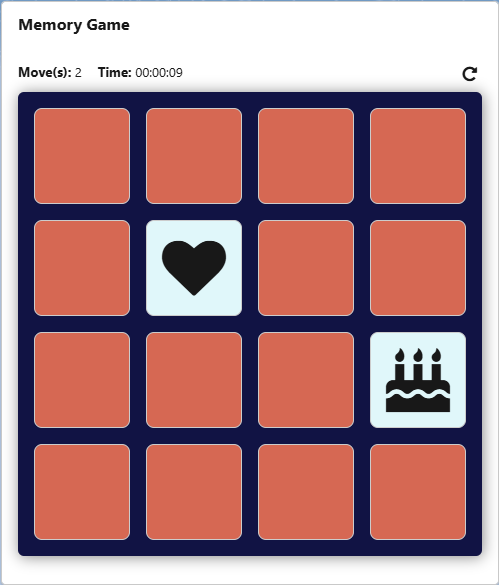
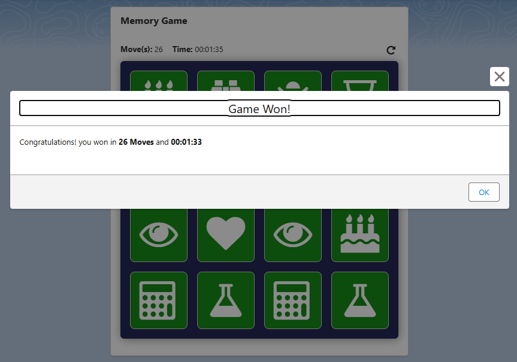

# Memory Game (Salesforce LWC)

A 4x4 memory game built with Salesforce Lightning Web Components (LWC). Players flip cards to reveal Font Awesome icons, aiming to match all 8 pairs in the fewest moves and shortest time. A modal displays the win message with moves and time. The game features a responsive grid, 3D flip animations, and a clean UI.

## Features

- 4x4 grid of 16 cards with Font Awesome icons on the front, blank backs.
- Y-axis flip animations using CSS 3D transforms.
- Tracks moves and elapsed time (HH:MM:SS).
- Modal popup on game completion with win details.
- Reset button to restart the game with shuffled cards.
- Responsive design with CSS Grid, maintaining square cards.

## Screenshots




## Technologies Used

- **Salesforce LWC**: Component-based framework for building the game.
- **CSS Grid**: Responsive 4x4 layout with `aspect-ratio: 1/1` for square cards.
- **CSS 3D Transforms**: Y-axis flip animations for card interactions.
- **Font Awesome**: Icons for card fronts, loaded via static resource.
- **Salesforce CLI (SFDX)**: Deployment to Salesforce org.

## Setup Instructions

1. **Clone the Repository**:
   ```bash
   git clone https://github.com/your-username/lwc-memory-game.git
   cd lwc-memory-game
   ```
2. **Authenticate with Salesforce Org**:

- sfdx force:auth:web:login -a my-org

3. **Deploy to Org**:

- sfdx force:source:deploy -p force-app/main/default

4. **Add to Lightning Page**:

- Go to Setup > Lightning App Builder.
- Create or edit a Lightning Page (e.g., App Page or Home Page).
- Drag the MemoryGame_Card component onto the page.
- Save and activate.

5. **Play the Game**:

- Navigate to the Lightning Page in your Salesforce org.
- Flip cards to match pairs. A modal appears when all 16 cards are matched.
- Use the Reset button to start a new game.

## Project Structure

memory-game-lwc/
├── force-app/
│ ├── main/
│ ├── default/
│ ├── lwc/
│ │ ├── MemoryGame_Card/
│ │ ├── MemoryGame_Tile/
│ │ ├── MemoryGameModal/
│ ├── staticresources/
│ ├── fontawesome/
├── manifest/
│ ├── package.xml
├── screenshots/
│ ├── gameplay.png
│ ├── modal.png
├── .gitattributes
├── .gitignore
├── LICENSE
├── sfdx-project.json
├── README.md

## Challenges Overcome

- **Modal Not Rendering Correctly**: Fixed by switching from template-based modal rendering to programmatic `LightningModal.open()`, ensuring proper display and close functionality for the win modal.
- **3D Animation Compatibility**: Ensured smooth card flip animations across browsers and Salesforce’s mobile app by adding vendor prefixes (`-webkit-transform`) and `backface-visibility: hidden`, addressing Shadow DOM constraints.

- Add high-score tracking with Salesforce Apex for persistent data storage.
- Implement difficulty levels (e.g., 6x6 grid).
- Enhance UI with animations (e.g., card shake on mismatch) or sound effects.

## Contact

[Sebastian Sosa] - [1986sebastiansosa@gmail.com](mailto:1986sebastiansosa@gmail.com) | [LinkedIn Profile](https://www.linkedin.com/in/sebastian-sosa-cinotti/)
