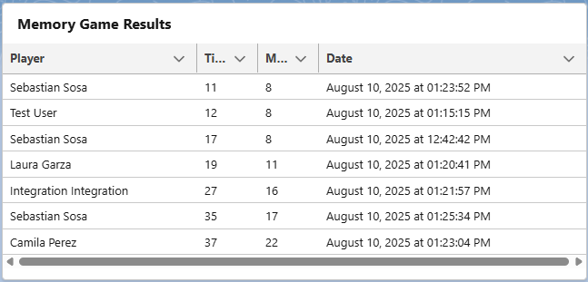

# Memory Game (Salesforce LWC)

A 4x4 memory game built with Salesforce Lightning Web Components (LWC). Players flip cards to reveal Font Awesome icons, aiming to match all 8 pairs in the fewest moves and shortest time. A modal displays the win message with moves and time. The game features a responsive grid, 3D flip animations, and a clean UI.

## Features

- 4x4 grid of 16 cards with Font Awesome icons on the front, blank backs.
- Y-axis flip animations using CSS 3D transforms.
- Tracks moves and elapsed time (HH:MM:SS).
- Modal popup on game completion with win details.
- Reset button to restart the game with shuffled cards.
- Responsive design with CSS Grid, maintaining square cards.
- Saves game results (player, moves, time, date) to a custom `Memory_Game_Result__c` object.
- Displays top game results in a `lightning-datatable`, ranked by moves and time.
- Uses Lightning Message Service to refresh the results table when a game is completed.

## Screenshots




## Technologies Used

- **Salesforce LWC**: Component-based framework for building the game.
- **CSS Grid**: Responsive 4x4 layout with `aspect-ratio: 1/1` for square cards.
- **CSS 3D Transforms**: Y-axis flip animations for card interactions.
- **Font Awesome**: Icons for card fronts, loaded via static resource.
- **Salesforce CLI (SFDX)**: Deployment to Salesforce org.
- **Apex**: Controller to save and retrieve game results from `Memory_Game_Result__c`.
- **Lightning Message Service (LMS)**: Real-time communication between game and results components.

## Setup Instructions

1. **Clone the Repository**:
   ```bash
   git clone https://github.com/your-username/lwc-memory-game.git
   cd lwc-memory-game
   ```
2. **Authenticate with Salesforce Org**:

- sfdx force:auth:web:login -a my-org

3. **Deploy to Org**:
```
sfdx force:source:deploy -p force-app/main/default
```
- This deploys the Memory_Game_Result__c custom object, fields, Apex controller, LWCs, and message channel.

4. **Grant Permissions**

- Go to Setup > Profiles > [User Profile] or create a permission set to add permission to the App
- Grant:Read/Create on Memory_Game_Result__c object and fields (Player__c, Moves__c, Time__c, Completed_on__c).
- Apex Class Access: MemoryGameResultController.

5. **Add to Lightning Page**:

- Go to Setup > Lightning App Builder.
- Create or edit a Lightning Page (e.g., App Page or Home Page).
- Drag the MemoryGame_Card and MemoryGameResultsTable component onto the page.
- Save and activate.

6. **Play the Game**:

- Navigate to the Lightning Page in your Salesforce org.
- Flip cards to match pairs. A modal appears when all 16 cards are matched.
- Game results are saved and displayed in the results table, ranked by moves and time.
- Use the Reset button to start a new game.

## Project Structure

```
memory-game-lwc/
├── force-app/
│   ├── main/
│   ├── default/
│   │   ├── classes/
│   │   │   ├── MemoryGameResultController.cls
│   │   │   ├── MemoryGameResultController.cls-meta.xml
│   │   ├── lwc/
│   │   │   ├── MemoryGame_Card/
│   │   │   ├── MemoryGame_Tile/
│   │   │   ├── MemoryGameModal/
│   │   │   ├── MemoryGameResultsTable/
│   │   ├── messageChannels/
│   │   │   ├── memoryGame.messageChannel-meta.xml
│   │   ├── objects/
│   │   │   ├── Memory_Game_Result__c/
│   │   ├── staticresources/
│   │   │   ├── fontawesome/
│   ├── manifest/
│   │   ├── package.xml
├── screenshots/
│   ├── gameplay.png
│   ├── modal.png
│   ├── memory-game-results-table.png
├── .gitattributes
├── .gitignore
├── LICENSE
├── sfdx-project.json
├── package.json
├── README.md
```

## Challenges Overcome

- **Modal Not Rendering Correctly**: Fixed by switching from template-based modal rendering to programmatic `LightningModal.open()`, ensuring proper display and close functionality for the win modal.
- **3D Animation Compatibility**: Ensured smooth card flip animations across browsers and Salesforce’s mobile app by adding vendor prefixes (`-webkit-transform`) and `backface-visibility: hidden`, addressing Shadow DOM constraints.
- **User Access Issues**: Resolved 500 errors by granting Apex class (MemoryGameResultController) and object (Memory_Game_Result__c) permissions to users via profiles or permission sets.

## Future Improvements

- Implement difficulty levels (e.g., 6x6 grid).
- Enhance UI with animations (e.g., card shake on mismatch) or sound effects.

## Contact

[Sebastian Sosa] - [1986sebastiansosa@gmail.com](mailto:1986sebastiansosa@gmail.com) | [LinkedIn Profile](https://www.linkedin.com/in/sebastian-sosa-cinotti/)
